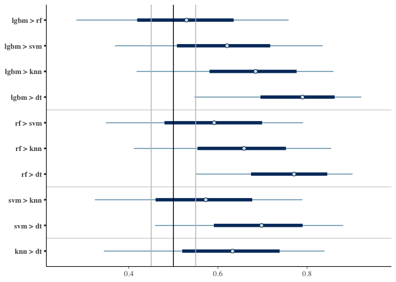
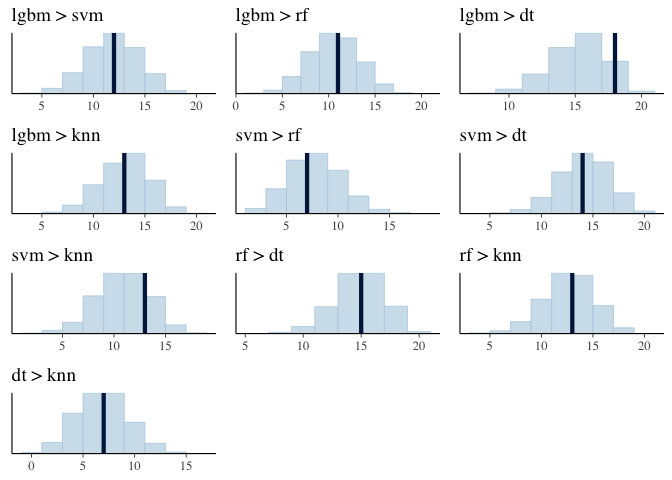

# A Bayesian Bradley Terry model to compare multiple algorithms on multiple data sets

## Installation

The `bbtcomp` package require the `cmdstanR` package, which is not in
CRAN. So you need to install `cmdstanR` manually, following the steps
described in <https://mc-stan.org/cmdstanr/>.

After `cmdstanR` is installed, install `bbtcomp` by issuing

    # install.packages("remotes")
    remotes::install_github("jwainer/bbtcomp")

## Data format

In general terms, data is organized as a data frame where the rows are
the data sets and the columns are the algorithms. The column names will
be used as the names of the algorithms being compared.

There may be a column that does not contain the results of an algorithm
in the data sets, but contain an id for each data set. This is called
the `dbcol`.

In more details, the data may be:

-   a data frame or an array, with no `dbcol`. The column names are the
    names of the algorithms, and the entry in line *i* and column *j* is
    the measure of some metric of algorithm *j* on the data set *i*.
    Usually, the measure is a mean of different evaluations on different
    test sets.

-   a data frame with a `dbcol` - a column with a string value that
    identifies the data set name.

-   two matrices, where the column name is the same on both, and where
    the first matrix contain the mean (across the cross validation) of
    the measure for each algorithm for each data set, and the second
    matrix, the standard deviation of the measures (across the cross
    validation). In this case the algorithm can compute the non-paired
    version of the local ROPE.

The algorithm assumes that the higher the value for the metric the
better, as it is with accuracy, AUC, F1 and other metrics. But if the
metric refer to an error measure, such as RMSE, MAE, and others, the
user should multiply these values by -1 (and therefore higher values -
negative but close to 0 - will be better). If the algorithm did not run
for that fold, or for that data set, the entry should be `NA`.

The `bbtcomp` package comes with a data set of the comparison of 17
algorithms on 132 data sets (as described in the paper). The data set is
called `ll`

    ll[1:8,]

    ##                       db      lgbm       svm        rf        dt       knn
    ## 1 analcatdata_authorship 0.9952607 1.0000000 0.9952607 0.9478673 0.9952607
    ## 2 analcatdata_authorship 0.9857143 0.9952381 0.9809524 0.8761905 0.9952381
    ## 3 analcatdata_authorship 0.9904762 1.0000000 0.9904762 0.9523810 0.9904762
    ## 4 analcatdata_authorship 0.9809524 0.9904762 0.9809524 0.9047619 1.0000000
    ## 5    analcatdata_boxing1 0.5000000 0.5666667 0.6666667 0.7666667 0.6333333
    ## 6    analcatdata_boxing1 0.6666667 0.6666667 0.7666667 0.8666667 0.7666667
    ## 7    analcatdata_boxing1 0.6666667 0.6333333 0.7666667 0.8000000 0.6333333
    ## 8    analcatdata_boxing1 0.6666667 0.6333333 0.7000000 0.7666667 0.7666667
    ##         xgb       xrf      svml        lr     ridge   passive       lda
    ## 1 0.9952607 0.9810427 0.9905213 0.9952607 0.9952607 0.9905213 0.9952607
    ## 2 0.9857143 0.9809524 0.9952381 0.9952381 0.9952381 0.9952381 0.9952381
    ## 3 0.9761905 0.9714286 0.9952381 1.0000000 1.0000000 0.9952381 0.9904762
    ## 4 0.9809524 0.9666667 1.0000000 1.0000000 1.0000000 1.0000000 1.0000000
    ## 5 0.8333333 0.7333333 0.5333333 0.5333333 0.5000000 0.6333333 0.5000000
    ## 6 0.9000000 0.8666667 0.7666667 0.7333333 0.7666667 0.6666667 0.7666667
    ## 7 0.7666667 0.8000000 0.7000000 0.6333333 0.6666667 0.6333333 0.7000000
    ## 8 0.7666667 0.7666667 0.7000000 0.6666667 0.7000000 0.6333333 0.7000000
    ##         qda        nb       gbm       mlp
    ## 1 0.9194313 0.9857820 0.9952607 1.0000000
    ## 2 0.8952381 0.9857143 0.9857143 0.9904762
    ## 3 0.9095238 0.9857143 0.9809524 0.9952381
    ## 4 0.9047619 0.9904762 0.9714286 1.0000000
    ## 5 0.6000000 0.6000000 0.8666667 0.6666667
    ## 6 0.8000000 0.8000000 0.8666667 0.8000000
    ## 7 0.7333333 0.7666667 0.8000000 0.8000000
    ## 8 0.7000000 0.7000000 0.7666667 0.6666667

Let us use a smaller sub-data set

    ss <- ll[1:80, 1:6] # first 20 data sets (4 folds each)  and 5 algorithms
    ss

    ##                         db      lgbm       svm        rf        dt       knn
    ## 1   analcatdata_authorship 0.9952607 1.0000000 0.9952607 0.9478673 0.9952607
    ## 2   analcatdata_authorship 0.9857143 0.9952381 0.9809524 0.8761905 0.9952381
    ## 3   analcatdata_authorship 0.9904762 1.0000000 0.9904762 0.9523810 0.9904762
    ## 4   analcatdata_authorship 0.9809524 0.9904762 0.9809524 0.9047619 1.0000000
    ## 5      analcatdata_boxing1 0.5000000 0.5666667 0.6666667 0.7666667 0.6333333
    ## 6      analcatdata_boxing1 0.6666667 0.6666667 0.7666667 0.8666667 0.7666667
    ## 7      analcatdata_boxing1 0.6666667 0.6333333 0.7666667 0.8000000 0.6333333
    ## 8      analcatdata_boxing1 0.6666667 0.6333333 0.7000000 0.7666667 0.7666667
    ## 9      analcatdata_boxing2 0.7575758 0.7878788 0.6666667 0.6969697 0.7272727
    ## 10     analcatdata_boxing2 0.7575758 0.6969697 0.6969697 0.6969697 0.5757576
    ## 11     analcatdata_boxing2 0.7575758 0.6060606 0.5757576 0.5757576 0.5757576
    ## 12     analcatdata_boxing2 0.8787879 0.7575758 0.6969697 0.7272727 0.6363636
    ## 13 analcatdata_creditscore 1.0000000 0.8400000 0.9200000 1.0000000 0.8800000
    ## 14 analcatdata_creditscore 0.9600000 0.7200000 0.9600000 0.9600000 0.7600000
    ## 15 analcatdata_creditscore 1.0000000 0.9200000 1.0000000 0.9600000 0.8400000
    ## 16 analcatdata_creditscore 1.0000000 0.7200000 0.9600000 1.0000000 0.7200000
    ## 17        analcatdata_dmft 0.1950000 0.1900000 0.1700000 0.1450000 0.1900000
    ## 18        analcatdata_dmft 0.1658291 0.2311558 0.1557789 0.1507538 0.1809045
    ## 19        analcatdata_dmft 0.2160804 0.2412060 0.2010050 0.2311558 0.2261307
    ## 20        analcatdata_dmft 0.1758794 0.2160804 0.1608040 0.1407035 0.1909548
    ## 21   analcatdata_germangss 0.3800000 0.2200000 0.2300000 0.3100000 0.1900000
    ## 22   analcatdata_germangss 0.3600000 0.2300000 0.2500000 0.3600000 0.2500000
    ## 23   analcatdata_germangss 0.4100000 0.2200000 0.3000000 0.3800000 0.2300000
    ## 24   analcatdata_germangss 0.3800000 0.2300000 0.2500000 0.2900000 0.2700000
    ## 25     analcatdata_lawsuit 0.9848485 0.9848485 0.9848485 0.9848485 0.9696970
    ## 26     analcatdata_lawsuit 0.9848485 0.9545455 0.9848485 0.9848485 0.9545455
    ## 27     analcatdata_lawsuit 0.9848485 0.9393939 0.9848485 0.9848485 0.9545455
    ## 28     analcatdata_lawsuit 0.9696970 0.9696970 0.9696970 0.9545455 0.9848485
    ## 29            appendicitis 0.8518519 0.8518519 0.8518519 0.8148148 0.8518519
    ## 30            appendicitis 0.8518519 0.8518519 0.8148148 0.7777778 0.8518519
    ## 31            appendicitis 0.8846154 0.9230769 0.9230769 0.7307692 0.8846154
    ## 32            appendicitis 0.8846154 0.8461538 0.9230769 0.8076923 0.8846154
    ## 33              australian 0.8497110 0.8728324 0.8728324 0.8497110 0.8497110
    ## 34              australian 0.8265896 0.8150289 0.8497110 0.7745665 0.8208092
    ## 35              australian 0.9011628 0.8779070 0.8953488 0.8197674 0.8662791
    ## 36              australian 0.8779070 0.8720930 0.9011628 0.8255814 0.8546512
    ## 37                    auto 0.8431373 0.5882353 0.8235294 0.7450980 0.5098039
    ## 38                    auto 0.7843137 0.7058824 0.7647059 0.7450980 0.7058824
    ## 39                    auto 0.7400000 0.6600000 0.8200000 0.7000000 0.6400000
    ## 40                    auto 0.9200000 0.6800000 0.8400000 0.9000000 0.5400000
    ## 41                backache 0.8222222 0.8666667 0.8666667 0.7555556 0.8444444
    ## 42                backache 0.8666667 0.8666667 0.8888889 0.8444444 0.8666667
    ## 43                backache 0.8888889 0.8666667 0.8666667 0.7777778 0.8444444
    ## 44                backache 0.8222222 0.8444444 0.8444444 0.7777778 0.8444444
    ## 45           balance_scale 0.8343949 0.9108280 0.8025478 0.7834395 0.8598726
    ## 46           balance_scale 0.9102564 0.8974359 0.8141026 0.7820513 0.8397436
    ## 47           balance_scale 0.8653846 0.9038462 0.8525641 0.7692308 0.8333333
    ## 48           balance_scale 0.8717949 0.9038462 0.8589744 0.7884615 0.8717949
    ## 49                  biomed 0.8301887 0.7924528 0.8301887 0.8113208 0.7735849
    ## 50                  biomed 0.8269231 0.8653846 0.8846154 0.7692308 0.8269231
    ## 51                  biomed 0.9230769 0.9423077 0.9230769 0.8461538 0.9423077
    ## 52                  biomed 0.9230769 0.9423077 0.9423077 0.9230769 0.9615385
    ## 53                  breast 0.9600000 0.9600000 0.9600000 0.9542857 0.9485714
    ## 54                  breast 0.9657143 0.9542857 0.9714286 0.9371429 0.9485714
    ## 55                  breast 0.9542857 0.9600000 0.9428571 0.9085714 0.9485714
    ## 56                  breast 0.9770115 0.9540230 0.9712644 0.9252874 0.9540230
    ## 57           breast_cancer 0.8194444 0.7361111 0.7777778 0.6805556 0.7222222
    ## 58           breast_cancer 0.7638889 0.7638889 0.7361111 0.6527778 0.7638889
    ## 59           breast_cancer 0.6901408 0.6619718 0.7323944 0.6760563 0.6760563
    ## 60           breast_cancer 0.6901408 0.7042254 0.7042254 0.5492958 0.6901408
    ## 61 breast_cancer_wisconsin 0.9860140 0.9720280 0.9720280 0.9300699 0.9860140
    ## 62 breast_cancer_wisconsin 0.9084507 0.9577465 0.9154930 0.8661972 0.9366197
    ## 63 breast_cancer_wisconsin 0.9718310 0.9788732 0.9507042 0.9014085 0.9647887
    ## 64 breast_cancer_wisconsin 0.9788732 0.9859155 0.9577465 0.9507042 0.9577465
    ## 65                breast_w 0.9542857 0.9542857 0.9714286 0.9542857 0.9771429
    ## 66                breast_w 0.9542857 0.9600000 0.9600000 0.9371429 0.9600000
    ## 67                breast_w 0.9714286 0.9600000 0.9714286 0.9314286 0.9600000
    ## 68                breast_w 0.9655172 0.9712644 0.9712644 0.9367816 0.9712644
    ## 69                buggyCrx 0.8612717 0.8554913 0.8786127 0.7976879 0.8554913
    ## 70                buggyCrx 0.8959538 0.8843931 0.8786127 0.8323699 0.8728324
    ## 71                buggyCrx 0.8430233 0.8430233 0.8546512 0.7674419 0.8430233
    ## 72                buggyCrx 0.8662791 0.8604651 0.8604651 0.7616279 0.8197674
    ## 73                    bupa 0.5172414 0.6666667 0.6206897 0.6206897 0.6091954
    ## 74                    bupa 0.5581395 0.6395349 0.5930233 0.6511628 0.6162791
    ## 75                    bupa 0.5000000 0.4883721 0.5348837 0.5697674 0.5581395
    ## 76                    bupa 0.5581395 0.5930233 0.5697674 0.5697674 0.6162791
    ## 77             calendarDOW 0.6200000 0.3100000 0.5600000 0.5700000 0.5600000
    ## 78             calendarDOW 0.6100000 0.3900000 0.6000000 0.5900000 0.5300000
    ## 79             calendarDOW 0.6400000 0.4200000 0.6600000 0.6500000 0.5800000
    ## 80             calendarDOW 0.6060606 0.3636364 0.6262626 0.5959596 0.6262626

This data frame corresponds to the second type of data for the bbtcomp
algorithm: a data frame with a column that indicates the data set, and
potentially multiple measures for each data set (for multiples folds).

A data frame that corresponds to the first data format is obtained by:

    library(dplyr)

    ## 
    ## Attaching package: 'dplyr'

    ## The following objects are masked from 'package:stats':
    ## 
    ##     filter, lag

    ## The following objects are masked from 'package:base':
    ## 
    ##     intersect, setdiff, setequal, union

    ssmean <- ll %>% group_by(db) %>% summarize(across(everything(),.fns = mean))
    ssmean <- ssmean[,-1]
    ssmean

    ## # A tibble: 132 × 16
    ##     lgbm   svm    rf    dt   knn   xgb   xrf  svml    lr ridge passive   lda
    ##    <dbl> <dbl> <dbl> <dbl> <dbl> <dbl> <dbl> <dbl> <dbl> <dbl>   <dbl> <dbl>
    ##  1 0.612 0.559 0.574 0.531 0.542 0.604 0.565 0.509 0.51  0.509   0.499 0.51 
    ##  2 0.554 0.514 0.559 0.524 0.533 0.579 0.539 0.513 0.512 0.513   0.505 0.514
    ##  3 0.718 0.624 0.646 0.577 0.556 0.712 0.649 0.498 0.501 0.499   0.492 0.498
    ##  4 0.658 0.636 0.622 0.559 0.562 0.642 0.643 0.484 0.484 0.485   0.505 0.484
    ##  5 0.685 0.614 0.638 0.547 0.551 0.659 0.629 0.499 0.499 0.501   0.507 0.499
    ##  6 0.555 0.515 0.550 0.551 0.525 0.542 0.525 0.729 0.692 0.698   0.574 0.680
    ##  7 0.573 0.515 0.585 0.575 0.559 0.603 0.536 0.703 0.661 0.669   0.587 0.677
    ##  8 1     0.989 1     1     0.998 1     0.997 0.949 0.950 0.944   0.935 0.944
    ##  9 0.973 0.957 0.974 0.964 0.965 0.972 0.973 0.936 0.962 0.962   0.959 0.964
    ## 10 0.989 0.973 0.981 0.977 0.976 0.987 0.982 0.973 0.974 0.973   0.972 0.951
    ## # ℹ 122 more rows
    ## # ℹ 4 more variables: qda <dbl>, nb <dbl>, gbm <dbl>, mlp <dbl>

The data is only a single measure for each algoritm (column) and for
each data set (implicitly each row). This format does not allow one to
use local ROPE (discussed below).

Finally the third format is a pair of data frames, one with the mean
measure for each data set and algorithm (the `ssmean` data frame above),
and one with the standard deviation of the measures. The second data
frame can be computed by:

    sssd <- ll %>% group_by(db) %>% summarize(across(everything(),.fns = sd))
    sssd <- sssd[,-1]
    sssd

    ## # A tibble: 132 × 16
    ##       lgbm      svm      rf      dt     knn     xgb     xrf     svml      lr
    ##      <dbl>    <dbl>   <dbl>   <dbl>   <dbl>   <dbl>   <dbl>    <dbl>   <dbl>
    ##  1 0.0244  0.0259   0.0250  0.0279  0.0174  0.0217  0.0195  0.0155   0.0157 
    ##  2 0.00921 0.0307   0.0333  0.0373  0.0209  0.0259  0.0295  0.0174   0.0154 
    ##  3 0.0151  0.0190   0.0179  0.0327  0.0454  0.0227  0.102   0.00826  0.0113 
    ##  4 0.0144  0.0178   0.0386  0.0283  0.0394  0.0195  0.00289 0.0273   0.0259 
    ##  5 0.0256  0.0236   0.0164  0.0159  0.0134  0.00777 0.0286  0.00315  0.00433
    ##  6 0.0337  0.0170   0.0182  0.0322  0.0273  0.0216  0.0135  0.0169   0.0102 
    ##  7 0.0357  0.0219   0.0202  0.0343  0.0240  0.0376  0.0296  0.0155   0.0224 
    ##  8 0       0.00249  0       0       0.00206 0       0.00244 0.00835  0.00261
    ##  9 0.00429 0.000530 0.00265 0.00508 0.00377 0.00401 0.00410 0.0474   0.00184
    ## 10 0.00329 0.000526 0.00252 0.00274 0.00235 0.00184 0.00150 0.000866 0.00219
    ## # ℹ 122 more rows
    ## # ℹ 7 more variables: ridge <dbl>, passive <dbl>, lda <dbl>, qda <dbl>,
    ## #   nb <dbl>, gbm <dbl>, mlp <dbl>

## Before you start using bbtcomp

### Running chains in parallel

First, to run the chains in parallel:

    options(mc.cores = parallel::detectCores(logical = FALSE))

If when running the bbtcomp you see the message

    Running MCMC with 4 sequential chains...

(the key word there is **sequential**) it is because you did not set up
Stan to run the chains in parallel with the `options` command above.

### Auxiliary folder

CmdStan which serve as the interface between bbtcomp and Stan (the MCMC
under the hood of bbtcomp) uses files as intemerdiary between the two
processes. First, the Bayesian model of BBT is translated into C++ and
then compiled and saved into a file. And the sampling process saves the
results as .csv files (one per chain). All these files are stored in an
auxiliary folder.

This auxiliary folder can be set using

    options(bbtcomp.dir = "~/.bbtcomp")

In this case the auxiliary folder is “~/.bbtcomp”. If the folder is not
set, than bbtcomp will use a temporary folder which will be deleted as
soon as the R session is terminated.

The advantage of setting the auxiliary folder with the `options` is that
the compiled Stan program is stored there and there will be no need to
compile it in another R session using bbtcomp. The disadvantage is that
each call to `bbtcomp` will generate 4 .csv files. The user should erase
all these .csv from time to time.

The advantages and disadvantages of using a temporary folder are the
opposite of the fixed auxiliary folder: new compilation of the Stan
model will be necessary in each time `bbtcomp` is called in a new R
session, but there is no need to delete the .csv files from time to
time.

## Basic use

Basic bbtcomp operation:

    x <- bbtcomp(ss)

    ## Running MCMC with 4 parallel chains...
    ## 
    ## Chain 1 finished in 0.1 seconds.
    ## Chain 2 finished in 0.1 seconds.
    ## Chain 3 finished in 0.1 seconds.
    ## Chain 4 finished in 0.1 seconds.
    ## 
    ## All 4 chains finished successfully.
    ## Mean chain execution time: 0.1 seconds.
    ## Total execution time: 0.3 seconds.

will return a `bbt model` which is a list with 3 components that
contains:

-   a `cmdstanr` fit model (with the samples)

-   a wintable

-   a Boolean stating whether the Davidson model was used

Let us plot the results:

    plot_pwin(x)

Let us see the results as a table:

    table_pwin(x)

    ##          pair mean delta above.50 in.rope
    ## 1   lgbm > rf 0.53  0.22     0.66    0.49
    ## 2  lgbm > svm 0.62  0.21     0.96    0.16
    ## 3  lgbm > knn 0.68  0.19     1.00    0.02
    ## 4   lgbm > dt 0.79  0.16     1.00    0.00
    ## 5    rf > svm 0.59  0.22     0.90    0.26
    ## 6    rf > knn 0.66  0.20     0.99    0.05
    ## 7     rf > dt 0.77  0.17     1.00    0.00
    ## 8   svm > knn 0.57  0.22     0.85    0.33
    ## 9    svm > dt 0.69  0.20     1.00    0.02
    ## 10   knn > dt 0.63  0.22     0.97    0.11

Or only the comparisons of the `rf` algorithms with the others

    table_pwin(x,control='rf')

    ##        pair mean delta above.50 in.rope
    ## 1 lgbm > rf 0.53  0.22     0.66    0.49
    ## 2  rf > svm 0.59  0.22     0.90    0.26
    ## 3  rf > knn 0.66  0.20     0.99    0.05
    ## 4   rf > dt 0.77  0.17     1.00    0.00

Or other summary of the probability distributions (median, low and high
limits of the 95% HDI):

    table_pwin(x, columns = c("median", "low", "high"), hdi=0.95)

    ##          pair median  low high
    ## 1   lgbm > rf   0.53 0.40 0.66
    ## 2  lgbm > svm   0.62 0.48 0.74
    ## 3  lgbm > knn   0.68 0.56 0.80
    ## 4   lgbm > dt   0.79 0.69 0.89
    ## 5    rf > svm   0.59 0.47 0.73
    ## 6    rf > knn   0.66 0.53 0.77
    ## 7     rf > dt   0.77 0.66 0.86
    ## 8   svm > knn   0.57 0.43 0.70
    ## 9    svm > dt   0.70 0.57 0.81
    ## 10   knn > dt   0.63 0.50 0.76

For the `ssmean` data format (without the dbcol), use

    x2 <- bbtcomp(ssmean, dbcol=0)

    ## Running MCMC with 4 parallel chains...
    ## 
    ## Chain 1 finished in 0.7 seconds.
    ## Chain 2 finished in 0.7 seconds.
    ## Chain 4 finished in 0.7 seconds.
    ## Chain 3 finished in 0.7 seconds.
    ## 
    ## All 4 chains finished successfully.
    ## Mean chain execution time: 0.7 seconds.
    ## Total execution time: 0.9 seconds.

For the `ssmean` and `ssds` data format (without the dbcol), use

    x3 <- bbtcomp(ssmean, sssd)

    ## Running MCMC with 4 parallel chains...
    ## 
    ## Chain 1 finished in 0.6 seconds.
    ## Chain 2 finished in 0.6 seconds.
    ## Chain 3 finished in 0.6 seconds.
    ## Chain 4 finished in 0.6 seconds.
    ## 
    ## All 4 chains finished successfully.
    ## Mean chain execution time: 0.6 seconds.
    ## Total execution time: 0.7 seconds.

### Local ROPE

Although the ss data has 4 entries for each data set, the results on 4
different test sets (4-fold cross validation), the results displayed
above compute the mean for each algorithm and data set and perform the
BBT on the mean results.

The paper discusses that using the fold data one can convert some of the
victories of one algorithm over another into a tie, because the
difference of the means is smaller or much smaller than the variance of
the results for the folds. The paper call it a local ROPE, and discusses
two different approaches to the local ROPE, when the measures for the
folds are paired (the same test set was measured for all algorithms) or
not paired (each test set was potentially different for each algorithm).

To use the local ROPE both the paired and not-paired versions:

    y <- bbtcomp(ss,lrope=T, paired=T) # paired version - default 

    ## Running MCMC with 4 parallel chains...
    ## 
    ## Chain 1 finished in 0.1 seconds.
    ## Chain 2 finished in 0.1 seconds.
    ## Chain 3 finished in 0.1 seconds.
    ## Chain 4 finished in 0.1 seconds.
    ## 
    ## All 4 chains finished successfully.
    ## Mean chain execution time: 0.1 seconds.
    ## Total execution time: 0.2 seconds.

    z <- bbtcomp(ss,lrope=T, paired=F) # not paired version 

    ## Running MCMC with 4 parallel chains...
    ## 
    ## Chain 1 finished in 0.1 seconds.
    ## Chain 2 finished in 0.1 seconds.
    ## Chain 3 finished in 0.1 seconds.
    ## Chain 4 finished in 0.1 seconds.
    ## 
    ## All 4 chains finished successfully.
    ## Mean chain execution time: 0.1 seconds.
    ## Total execution time: 0.2 seconds.

In the case of the ss data in particular, using either version of the
local ROPE will not change the number of victories and losses into ties
except for one pair of algorithms.

For the other data formats: only the mean data `ssmean` does not allow
the computation of the local ROPE. For the mean and standard deviation
data (`ssmean` and `ssds`) only the non paired version of local ROPE can
be computed.

### Convergence check

Convergence check of the sampling is performed by the
`convergence_check` function, which only calls the `cmdstan_diagnose`
function from `cmdstan`.

`cmdstanr` uses a directory to store two important information of the
sampling. The fist information is the compiled Stan model. The first
time one calls `bbtcomp` the Stan model is compiled and stored in this
directory. The directory is set by the `dir` parameter of the `bbtcomp`
function, and the default is `.bbtcomp` on the current directory.

The second data stored in the directory are the .csv files with the
samples themselves. The default case is to run 4 chains of sampling in
parallel, and thus the sampling process generates 4 .csv files with the
results of the sampling. The samples themselves are part of the bbt
model object returned by `bbtcomp` and this object is passed to the
functions that will generate the tables and the graphs. The default for
`bbtcomp` is to delete the .csv in the directory since they tend to grow
(each call to `bbtcomp` generates 4 new large .csv files). But the
convergence check performed by the `cmdstan_diagnose` function reads
those files. Therefore, in order to perform the convergence tests one
must disable the cleaning of the .csv files

    y <- bbtcomp(ss) 

    ## Running MCMC with 4 parallel chains...
    ## 
    ## Chain 1 finished in 0.1 seconds.
    ## Chain 2 finished in 0.1 seconds.
    ## Chain 3 finished in 0.1 seconds.
    ## Chain 4 finished in 0.1 seconds.
    ## 
    ## All 4 chains finished successfully.
    ## Mean chain execution time: 0.1 seconds.
    ## Total execution time: 0.2 seconds.

    convergence_check(y) 

    ## Processing csv files: /Users/wainer/.bbtcomp/bbt-full-202308041355-1-3aaf91.csv, /Users/wainer/.bbtcomp/bbt-full-202308041355-2-3aaf91.csv, /Users/wainer/.bbtcomp/bbt-full-202308041355-3-3aaf91.csv, /Users/wainer/.bbtcomp/bbt-full-202308041355-4-3aaf91.csv
    ## 
    ## Checking sampler transitions treedepth.
    ## Treedepth satisfactory for all transitions.
    ## 
    ## Checking sampler transitions for divergences.
    ## No divergent transitions found.
    ## 
    ## Checking E-BFMI - sampler transitions HMC potential energy.
    ## E-BFMI satisfactory.
    ## 
    ## Effective sample size satisfactory.
    ## 
    ## Split R-hat values satisfactory all parameters.
    ## 
    ## Processing complete, no problems detected.

### Posterior Predictive check

The posterior pretictive checks of the model in relation to the data,
can be generated by

    plot_ppc(y) 

And the table version if the graphs as

    table_ppc(y) 

    ##    hdi proportion
    ## 1 0.50        0.8
    ## 2 0.90        1.0
    ## 3 0.95        1.0
    ## 4 1.00        1.0

### The win/losses table

The table of win and losses (a wintable) for all algorithms can be
accessed as the `wintable` component of the model returned by `bbtcomp`.
To print the table of victories and losses with the ties explicit (or
unprocessed) use:

    table_wintable(y$wintable, which = "pre") 

    ##    alg1 alg2 win1(pre) win2(pre) ties(pre)
    ## 1  lgbm  svm         9         5         6
    ## 2  lgbm   rf         7         6         7
    ## 3  lgbm   dt        18         2         0
    ## 4  lgbm  knn        11         5         4
    ## 5   svm   rf         5        11         4
    ## 6   svm   dt        13         6         1
    ## 7   svm  knn         9         3         8
    ## 8    rf   dt        14         4         2
    ## 9    rf  knn        11         5         4
    ## 10   dt  knn         6        12         2

To print the table with the ties processed, use

    table_wintable(y$wintable) 

    ##    alg1 alg2 win1 win2
    ## 1  lgbm  svm   12    8
    ## 2  lgbm   rf   11   10
    ## 3  lgbm   dt   18    2
    ## 4  lgbm  knn   13    7
    ## 5   svm   rf    7   13
    ## 6   svm   dt   14    7
    ## 7   svm  knn   13    7
    ## 8    rf   dt   15    5
    ## 9    rf  knn   13    7
    ## 10   dt  knn    7   13

To print both side by side:

    table_wintable(y$wintable, which = "both") 

    ##    alg1 alg2 win1 win2 win1(pre) win2(pre) ties(pre)
    ## 1  lgbm  svm   12    8         9         5         6
    ## 2  lgbm   rf   11   10         7         6         7
    ## 3  lgbm   dt   18    2        18         2         0
    ## 4  lgbm  knn   13    7        11         5         4
    ## 5   svm   rf    7   13         5        11         4
    ## 6   svm   dt   14    7        13         6         1
    ## 7   svm  knn   13    7         9         3         8
    ## 8    rf   dt   15    5        14         4         2
    ## 9    rf  knn   13    7        11         5         4
    ## 10   dt  knn    7   13         6        12         2

## Python implementation

### Installation

The python implementation needs `cmdstanPy` package, so please install
it following the steps described in <https://mc-stan.org/cmdstanpy/>

Download the files in the `python` directory to your current directory.
The files are

-   bbtcomp.py
-   stan-full.stan
-   ll.csv

`ll.csv` is the `ll` data available in the R package. If you want to
read it use:

    import pandas as pd
    ll = pd.read_csv("./ll.csv")

If you do not want to use this data, there is no need to download the
file.

`bbtcomp.py` and `stan-full.stan` should be in the current directory.

Then issue:

    import bbtcomp

### Using the python implementation

The python file only implements two of the R package functions

-   `bbtcomp`(data)

-   `table_pwin`(model)

`bbtcomp` has the same parameters, data formats and so on, as the R
counterpart. But

-   to indicate that there is no `dbcol` use `dbcol=None` or `dbcol=-1`

-   to control the auxiliary folder, set the parameter `output_dir` to
    the auxiliary folder. If left unset, bbtcomp will use a temporary
    folder which will be deleted as soon as the python session is
    terminated.
