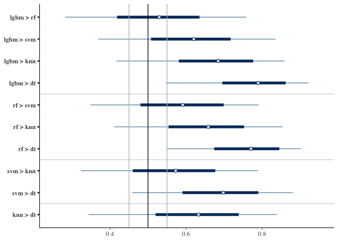
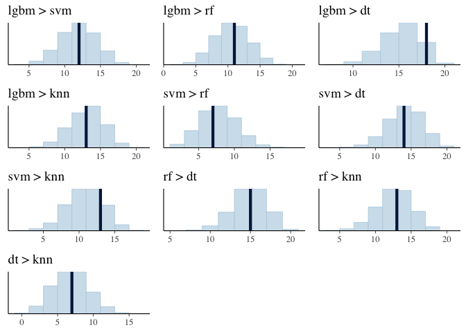

# bbtcomp: a Bayesian Bradley-Terry model to compare multiple algorithms on multiple data sets

`bbtcomp` fits a Bayesian Bradley-Terry (BBT) model to compare multiple
algorithms (or methods, or configurations) across multiple data sets, using
any performance metric (accuracy, F1, AUC, RMSE, ...). See the accompanying
paper for the statistical background (the BBT model, the region of practical
equivalence -- ROPE -- and "local ROPE").

This repository contains two independent, feature-equivalent
implementations:

- **R**, in [`bbtcomp_R/`](bbtcomp_R/) -- the original implementation.
- **Python**, in [`bbtcomp_python/`](bbtcomp_python/) -- a port with the same
  functions, arguments, and behavior.

Both wrap [Stan](https://mc-stan.org/) (via `cmdstanr` in R, `cmdstanpy` in
Python) to fit the model, and both need CmdStan installed separately (see
below). Pick whichever language you work in; this page installs both and
walks through the same tutorial in parallel, R on the left, the equivalent
Python on the right.

## Installation

Both languages follow the same two-step pattern: install the `bbtcomp`
package itself first (which pulls in `cmdstanr`/`cmdstanpy` as an ordinary
dependency), then install CmdStan -- the compiled Stan backend that actually
runs the sampler. CmdStan is not an R or Python package, so `remotes`/`pip`
have no way to install or verify it as part of installing `bbtcomp`; that
last step is a separate, explicit call you make yourself, and `bbtcomp`
tells you exactly when and how to make it.

### R

Install `bbtcomp` from this repository's `bbtcomp_R/` subdirectory:

```r
# install.packages("remotes")
remotes::install_github("jwainer/bbtcomp", subdir = "bbtcomp_R")
```

This also installs the `cmdstanr` R package. Then check whether CmdStan
itself is set up:

```r
check_setup()
# CmdStan found at: /path/to/cmdstan-x.y.z
```

If CmdStan isn't found yet, `check_setup()` prints (or, with
`check_setup(raise_on_error = TRUE)`, stops with) instructions -- in short,
run:

```r
cmdstanr::install_cmdstan()
```

which downloads and compiles CmdStan for you. `bbtcomp()` / `mcmcbbt()` also
run the `check_setup()` check automatically and fail fast with the same
message if CmdStan is missing.

### Python

Install `bbtcomp` from this repository's `bbtcomp_python/` subdirectory:

```bash
pip install "git+https://github.com/jwainer/bbtcomp.git#subdirectory=bbtcomp_python"
```

Optional extras -- pick these based on which extra functions you plan to
use, since each pulls in an additional dependency that plain `bbtcomp`
doesn't need:

```bash
# adds matplotlib, needed only if you'll call plot_pwin() / plot_ppc()
pip install "bbtcomp[plots] @ git+https://github.com/jwainer/bbtcomp.git#subdirectory=bbtcomp_python"

# adds arviz, needed only if you'll call get_waic() / get_loo()
pip install "bbtcomp[waic] @ git+https://github.com/jwainer/bbtcomp.git#subdirectory=bbtcomp_python"
```

If you don't yet know whether you'll need the plots or model-comparison
functions, the plain `pip install bbtcomp` above is enough to get started --
`table_pwin()`, `table_ppc()`, and the rest of the tutorial below all work
without either extra; you can always install an extra later when you reach
the section that needs it.

This also installs the `cmdstanpy` Python package. Then check whether
CmdStan itself is set up:

```python
from bbtcomp import check_setup

check_setup()
# CmdStan found at: /path/to/cmdstan-x.y.z
```

If CmdStan isn't found yet, `check_setup()` prints (or, with
`check_setup(raise_on_error=True)`, raises) instructions -- in short, run:

```python
import cmdstanpy

cmdstanpy.install_cmdstan()
```

which downloads and compiles CmdStan for you. `bbtcomp()` / `mcmcbbt()` also
run the `check_setup()` check automatically and fail fast with the same
message if CmdStan is missing.

## Data format

In general terms, data is organized as a table where the rows are the data
sets and the columns are the algorithms. The column names are used as the
names of the algorithms being compared.

There may be a column that does not contain the results of an algorithm in
the data sets, but instead contains an id for each data set. This is called
the `dbcol`.

In more detail, the data may be:

- a table with no `dbcol`. The column names are the names of the algorithms,
  and the entry in row *i* and column *j* is the measure of some metric of
  algorithm *j* on the data set *i*. Usually, the measure is a mean of
  different evaluations on different test sets.
- a table with a `dbcol` -- a column with a string value that identifies the
  data set name. This allows multiple rows per data set (one per
  cross-validation fold), which enables the "local ROPE" (below).
- two tables, with the same column names in both: the first containing the
  mean (across the cross-validation folds) of the measure for each algorithm
  and data set, and the second, the standard deviation of the measures
  (across the same folds). In this case the algorithm can compute the
  non-paired version of the local ROPE.

Higher values must mean "better" (accuracy, AUC, F1, ...); negate error-like
metrics (RMSE, MAE, ...) first. If the algorithm did not run for that fold,
or for that data set, the entry should be missing (`NA` in R, `NaN` in
Python).

The package bundles the `ll` data set used in the paper: several classifiers
compared on 132 data sets (4 folds each).

<table>
<tr><th>R</th><th>Python</th></tr>
<tr><td>

```r
ll[1:8, ]
```

</td><td>

```python
from bbtcomp import load_ll

ll = load_ll()
ll.iloc[0:8]
```

</td></tr>
</table>

Let us use a smaller sub-data set:

<table>
<tr><th>R</th><th>Python</th></tr>
<tr><td>

```r
ss <- ll[1:80, 1:6]  # first 20 data sets (4 folds each) and 5 algorithms
ss
```

</td><td>

```python
ss = ll.iloc[0:80, 0:6]  # first 20 data sets (4 folds each), 5 algorithms
ss
```

</td></tr>
</table>

This corresponds to the second type of data for `bbtcomp`: a table with a
column that indicates the data set (`dbcol`), and potentially multiple
measures for each data set (for multiple folds).

A table that corresponds to the first data format is obtained by averaging
over folds. In R:

```r
library(dplyr)

ssmean <- ss %>% group_by(db) %>% summarize(across(everything(), .fns = mean))
ssmean <- ssmean[, -1]
ssmean
```

and the equivalent in Python:

```python
ssmean = ss.groupby("db").mean().reset_index(drop=True)
```

This data has only a single measure per algorithm (column) and per data set
(each row, implicitly). This format does not allow one to use the local
ROPE (discussed below).

Finally, the third format is a pair of tables, one with the mean measure for
each data set and algorithm (the `ssmean` table above), and one with the
standard deviation of the measures. In R:

```r
sssd <- ss %>% group_by(db) %>% summarize(across(everything(), .fns = sd))
sssd <- sssd[, -1]
```

and in Python:

```python
sssd = ss.groupby("db").std().reset_index(drop=True)
```

## Before you start using bbtcomp

### Running chains in parallel

<table>
<tr><th>R</th><th>Python</th></tr>
<tr><td>

By default `cmdstanr` runs the chains sequentially unless told otherwise:

```r
options(mc.cores = parallel::detectCores(logical = FALSE))
```

If, when running `bbtcomp`, you see the message `Running MCMC with 4
sequential chains...` (the key word is **sequential**), it is because you
did not set up Stan to run the chains in parallel with the `options` command
above.

</td><td>

By default `cmdstanpy`'s `CmdStanModel.sample()` already defaults
`parallel_chains` to the number of CPUs, so no setup is normally needed. To
control it explicitly, pass `parallel_chains` (and `chains`) directly:

```python
x = bbtcomp(ss, parallel_chains=4)
```

</td></tr>
</table>

### Auxiliary folder

CmdStan, which serves as the interface between `bbtcomp` and Stan (the MCMC
engine under the hood of `bbtcomp`), uses files as an intermediary between
the two processes. First, the Bayesian model of BBT is translated into C++
and then compiled and saved into a file. The sampling process then saves the
results as `.csv` files (one per chain). All these files are stored in an
auxiliary folder.

<table>
<tr><th>R</th><th>Python</th></tr>
<tr><td>

This auxiliary folder can be set for the whole R session using:

```r
options(bbtcomp.dir = "~/.bbtcomp")
```

If the folder is not set, `bbtcomp` will use a temporary folder that will be
deleted as soon as the R session is terminated.

</td><td>

Python has no equivalent of R's `options()` -- there is no global settings
registry -- so the direct translation is a plain package-level variable,
`bbtcomp.DEFAULT_OUTPUT_DIR`, which every call that omits `output_dir` falls
back to:

```python
import bbtcomp

bbtcomp.DEFAULT_OUTPUT_DIR = "~/.bbtcomp"

x = bbtcomp.bbtcomp(ss)  # reuses ~/.bbtcomp, no output_dir needed
```

An explicit `output_dir=...` on a given call always takes precedence; if
neither is set, a fresh temporary directory is used.

</td></tr>
</table>

The advantage of setting the auxiliary folder is that the compiled Stan
program is stored there and there is no need to compile it again in another
session. The disadvantage is that each call generates 4 `.csv` files, and
the user should erase these `.csv` files from time to time. Leaving it unset
has the opposite trade-off: a new compilation each session, but nothing to
clean up.

## Basic use

<table>
<tr><th>R</th><th>Python</th></tr>
<tr><td>

```r
x <- bbtcomp(ss)
```

```
## Running MCMC with 4 parallel chains...
##
## Chain 1 finished in 0.1 seconds.
## Chain 2 finished in 0.1 seconds.
## Chain 3 finished in 0.1 seconds.
## Chain 4 finished in 0.1 seconds.
##
## All 4 chains finished successfully.
## Mean chain execution time: 0.1 seconds.
## Total execution time: 0.3 seconds.
```

</td><td>

```python
from bbtcomp import bbtcomp, table_pwin, table_ppc, table_wintable, plot_pwin, plot_ppc

x = bbtcomp(ss)
```

*(output not shown -- `cmdstanpy` prints its own progress log)*

</td></tr>
</table>

`bbtcomp()`/`bbtcomp` returns a BBT model, a list/object with three
components: a fitted Stan model (with the samples), a wintable, and a flag
stating whether the Davidson model was used.

Let us plot the results:

<table>
<tr><th>R</th><th>Python</th></tr>
<tr><td>

```r
plot_pwin(x)
```



</td><td>

```python
plot_pwin(x)
```

</td></tr>
</table>

Let us see the results as a table:

<table>
<tr><th>R</th><th>Python</th></tr>
<tr><td>

```r
table_pwin(x)
```

```
##          pair mean delta above.50 in.rope
## 1   lgbm > rf 0.53  0.22     0.66    0.49
## 2  lgbm > svm 0.62  0.21     0.96    0.16
## 3  lgbm > knn 0.68  0.19     1.00    0.02
## 4   lgbm > dt 0.79  0.16     1.00    0.00
## 5    rf > svm 0.59  0.22     0.90    0.26
## 6    rf > knn 0.66  0.20     0.99    0.05
## 7     rf > dt 0.77  0.17     1.00    0.00
## 8   svm > knn 0.57  0.22     0.85    0.33
## 9    svm > dt 0.69  0.20     1.00    0.02
## 10   knn > dt 0.63  0.22     0.97    0.11
```

</td><td>

```python
table_pwin(x)
#          pair  mean  delta  above.50  in.rope
# 0   lgbm > rf  0.53   0.22      0.66     0.49
# ...
```

</td></tr>
</table>

`table_pwin()` returns a data.frame (R: S3 class `"bbt_pwin_table"`; Python:
`PwinTable`, a `pandas.DataFrame` subclass) where the two algorithm names of
each pair are stored as separate `larger`/`smaller` columns (the printed
`pair` column above is just those two combined for display, e.g.
`"lgbm > rf"` means `larger = "lgbm"`, `smaller = "rf"`), so code can use
them directly instead of parsing the printed string back apart:

<table>
<tr><th>R</th><th>Python</th></tr>
<tr><td>

```r
subset(table_pwin(x), larger == "lgbm")
```

</td><td>

```python
tp = table_pwin(x)
tp["larger"]                        # -> a plain pandas Series
tp[tp["larger"] == "lgbm"]          # every pair lgbm won on average
```

</td></tr>
</table>

Or only the comparisons of the `rf` algorithm with the others:

<table>
<tr><th>R</th><th>Python</th></tr>
<tr><td>

```r
table_pwin(x, control = 'rf')
```

```
##       pair mean delta above.50 in.rope
## 1 lgbm > rf 0.53  0.22     0.66    0.49
## 2  rf > svm 0.59  0.22     0.90    0.26
## 3  rf > knn 0.66  0.20     0.99    0.05
## 4   rf > dt 0.77  0.17     1.00    0.00
```

</td><td>

```python
table_pwin(x, control="rf")
```

</td></tr>
</table>

Or other summaries of the probability distributions (median, low and high
limits of the 95% HDI):

<table>
<tr><th>R</th><th>Python</th></tr>
<tr><td>

```r
table_pwin(x, columns = c("median", "low", "high"), hdi = 0.95)
```

</td><td>

```python
table_pwin(x, columns=["median", "low", "high"], hdi_prob=0.95)
```

</td></tr>
</table>

For the `ssmean` data format (without the `dbcol`), use:

<table>
<tr><th>R</th><th>Python</th></tr>
<tr><td>

```r
x2 <- bbtcomp(ssmean, dbcol = 0)
```

</td><td>

```python
x2 = bbtcomp(ssmean, dbcol=None)
```

</td></tr>
</table>

For the `ssmean` and `sssd` data format (mean + standard deviation, without
the `dbcol`), use:

<table>
<tr><th>R</th><th>Python</th></tr>
<tr><td>

```r
x3 <- bbtcomp(ssmean, sssd)
```

</td><td>

```python
x3 = bbtcomp(ssmean, sssd, dbcol=None)
```

</td></tr>
</table>

### Local ROPE

Although the `ss` data has 4 entries for each data set -- the results on 4
different test sets (4-fold cross-validation) -- the results displayed above
compute the mean for each algorithm and data set and perform the BBT on the
mean results.

The paper discusses that using the fold data one can convert some of the
victories of one algorithm over another into a tie, because the difference
of the means is smaller or much smaller than the variance of the results
for the folds. The paper calls it a local ROPE, and discusses two different
approaches to the local ROPE, when the measures for the folds are paired
(the same test set was measured for all algorithms) or not paired (each test
set was potentially different for each algorithm).

To use the local ROPE, both the paired and not-paired versions:

<table>
<tr><th>R</th><th>Python</th></tr>
<tr><td>

```r
y <- bbtcomp(ss, lrope = T, paired = T)  # paired version - default
z <- bbtcomp(ss, lrope = T, paired = F)  # not paired version
```

</td><td>

```python
y = bbtcomp(ss, lrope=True, paired=True)   # paired version - default
z = bbtcomp(ss, lrope=True, paired=False)  # not paired version
```

</td></tr>
</table>

In the case of the `ss` data in particular, using either version of the
local ROPE will not change the number of victories and losses into ties
except for one pair of algorithms.

For the other data formats: only the mean data `ssmean` does not allow the
computation of the local ROPE. For the mean and standard deviation data
(`ssmean` and `sssd`) only the non-paired version of local ROPE can be
computed.

### Convergence check

Convergence check of the sampling is performed by the `convergence_check`
function, which only calls the `cmdstan_diagnose` function from CmdStan.

By default, `bbtcomp` deletes the sampler's `.csv` files after use (they
tend to grow large), but the convergence check needs to read them, so to run
it you must keep them around for that call.

<table>
<tr><th>R</th><th>Python</th></tr>
<tr><td>

```r
y <- bbtcomp(ss)
convergence_check(y)
```

```
## Processing csv files: ...
##
## Checking sampler transitions treedepth.
## Treedepth satisfactory for all transitions.
##
## Checking sampler transitions for divergences.
## No divergent transitions found.
##
## Checking E-BFMI - sampler transitions HMC potential energy.
## E-BFMI satisfactory.
##
## Effective sample size satisfactory.
##
## Split R-hat values satisfactory all parameters.
##
## Processing complete, no problems detected.
```

</td><td>

```python
from bbtcomp import convergence_check

y = bbtcomp(ss, output_dir="~/.bbtcomp")  # keep the sampler csv files
convergence_check(y)
```

</td></tr>
</table>

### Posterior Predictive Check

The posterior predictive checks of the model in relation to the data can be
generated by:

<table>
<tr><th>R</th><th>Python</th></tr>
<tr><td>

```r
plot_ppc(y)
```



</td><td>

```python
plot_ppc(y)
```

</td></tr>
</table>

The table version of the same check is obtained as:

<table>
<tr><th>R</th><th>Python</th></tr>
<tr><td>

```r
table_ppc(y)
```

```
##    hdi proportion
## 1 0.50        0.8
## 2 0.90        1.0
## 3 0.95        1.0
## 4 1.00        1.0
```

</td><td>

```python
table_ppc(y)
```

</td></tr>
</table>

### The win/loss table

The table of wins and losses (a wintable) for all algorithms can be accessed
as the `wintable` component of the model returned by `bbtcomp`. To print the
table of victories and losses with the ties shown explicitly (i.e.,
unprocessed), use:

<table>
<tr><th>R</th><th>Python</th></tr>
<tr><td>

```r
table_wintable(y$wintable, which = "pre")
```

</td><td>

```python
table_wintable(y.wintable, which="pre")
```

</td></tr>
</table>

To print the table with the ties processed, use:

<table>
<tr><th>R</th><th>Python</th></tr>
<tr><td>

```r
table_wintable(y$wintable)
```

</td><td>

```python
table_wintable(y.wintable)
```

</td></tr>
</table>

To print both tables side by side:

<table>
<tr><th>R</th><th>Python</th></tr>
<tr><td>

```r
table_wintable(y$wintable, which = "both")
```

</td><td>

```python
table_wintable(y.wintable, which="both")
```

</td></tr>
</table>

### Model comparison

<table>
<tr><th>R</th><th>Python</th></tr>
<tr><td>

```r
get_waic(y)
get_loo(y)
```

</td><td>

```python
from bbtcomp import get_waic, get_loo

get_waic(y)
get_loo(y)
```

</td></tr>
</table>

## Further reading

- [`bbtcomp_R/README.md`](bbtcomp_R/README.md) -- the full R reference, with
  every function's output shown.
- [`bbtcomp_python/README.md`](bbtcomp_python/README.md) -- the full Python
  reference, including installation extras and the test suite.
- `paper/` -- the paper describing the BBT model, ROPE, and local ROPE.
